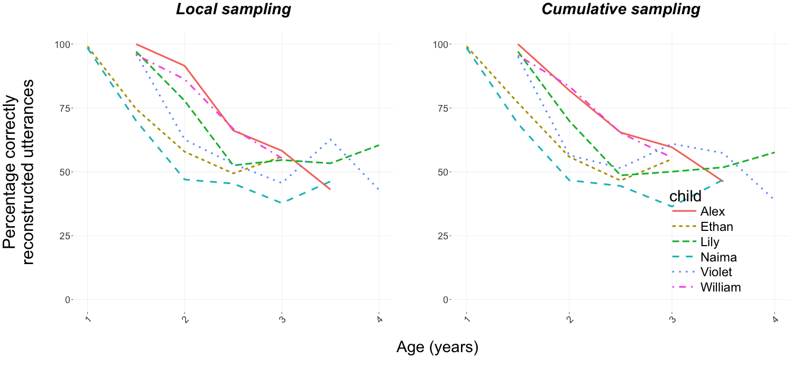
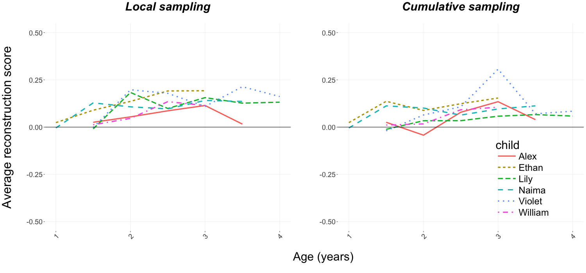

```{r setup, include = FALSE}
library("papaja")
library(tidyverse)
library(lme4)
library(grid)
library(gridExtra)
library(stringr)
library(jtools)
library(lattice)
library(plotrix)
```

```{r globals-and-helpers}
# Seed for random number generation
set.seed(42)
knitr::opts_chunk$set(cache.extra = knitr::rand_seed)

rawdata.local.path <- "data/main/local/"
rawdata.cumulative.path <- "data/main/cumulative/"
childuttdata.path <- "data/main/childutt/"
suppl.rawdata.local.path <- "data/suppl/local/"
suppl.rawdata.cumulative.path <- "data/suppl/cumulative/"
maintext.models <- "all_model_tables.csv"
plot.path <- "plots/"

options(digits = 3)

basic.theme <- theme(
  panel.background = element_rect(
    fill = "transparent",colour = NA),
  panel.grid.major = element_line(colour = "grey95"),
  panel.grid.minor = element_blank(),
  plot.background = element_rect(
    fill = "transparent",colour = NA),
  legend.background = element_rect(
    fill="transparent"),
  legend.text = element_text(size=24),
  legend.title = element_text(size=30),
  legend.key.height = unit(2, "lines"),
  legend.key = element_rect(colour = NA, fill = NA),
  axis.text.x = element_text(size=30, angle=45, hjust=1),
  axis.title.x = element_text(size=30),
  axis.text.y = element_text(size=28),
  axis.title.y = element_text(size=32),
  strip.text = element_text(size=30),
  panel.spacing = unit(2, "lines"))

```

```{r prep-data}
## Statistical model tables from main text
main.models <- read_csv(maintext.models)

# Local input
filenames <- list.files(path = suppl.rawdata.local.path,
  pattern="*productiontask_keep_all-modified.csv")
suppl.local.data.list <-lapply(paste0(
  suppl.rawdata.local.path,filenames),
  na.strings=c("NaN","Nan"),
  stringsAsFactors = FALSE,read.csv)
suppl.local.data <- do.call(rbind, suppl.local.data.list)
# overwrite utterance number to avoid double numbers
suppl.local.data$num = 1:nrow(suppl.local.data)
# convert age variable to numeric values and months into years
suppl.local.data$age <- gsub("_", ".", suppl.local.data$age)
suppl.local.data$age <- gsub("6", "5", suppl.local.data$age)
suppl.local.data$age <- as.numeric(suppl.local.data$age)
suppl.local.data <- subset(suppl.local.data, select = c(2:13))

# Cumulative input
filenames <- list.files(path = suppl.rawdata.cumulative.path,
  pattern="*productiontask_keep_all-modified.csv")
suppl.cumu.data.list <- lapply(paste0(
  suppl.rawdata.cumulative.path,filenames),
  na.strings=c("NaN","Nan"),
  stringsAsFactors = FALSE,read.csv)
suppl.cumu.data <- do.call(rbind, suppl.cumu.data.list)
# overwrite utterance number to avoid double numbers
suppl.cumu.data$num = 1:nrow(suppl.cumu.data)
# convert age variable to numeric values and months into years
suppl.cumu.data$age <- gsub("_", ".", suppl.cumu.data$age)
suppl.cumu.data$age <- gsub("6", "5", suppl.cumu.data$age)
suppl.cumu.data$age <- as.numeric(suppl.cumu.data$age)
suppl.cumu.data <- subset(suppl.cumu.data, select = c(2:13))

# Child utterances
filenames <- list.files(path=childuttdata.path,
  pattern="*.txt")
childutt.data <- NULL
for (file in filenames){
  temp.data <- read.delim(paste0(childuttdata.path, file))
  colnames(temp.data) <- c("utterance")
  temp.data$child <- unlist(strsplit(unlist(
    strsplit(file, "_age"))[1],"child"))[2]
  temp.data$age <- unlist(strsplit(unlist(
    strsplit(file, "_age"))[2],".txt"))
  childutt.data <- rbind(childutt.data,temp.data)
}
# convert age variable to numeric values and months into years
childutt.data$age <- gsub("_", ".", childutt.data$age)
childutt.data$age <- gsub("6", "5", childutt.data$age)
childutt.data$age <- as.numeric(childutt.data$age)
childutt.data$numwords <- str_count(childutt.data$utterance," ")

```
# Full model output of main text analyses

**Below readers will find the full statistical model output for each of the six models reported in the main text (that is, one for local input and one for cumulative input for each of the three analyses: uncorrected likelihood of accurate reconstruction, corrected reconstruction accuracy, and likelihood of unseen words).**

\pagebreak

```{r tab-uncorr_reconstr_acc-local-MAIN, echo=FALSE, results='asis', message=FALSE, warning=FALSE}
uncorr_reconstr_acc_local_MAIN.model <- filter(
  main.models, model == "uncorrected_accuracy_local_input") %>%
  select(-model)
apa_table(uncorr_reconstr_acc_local_MAIN.model, caption="**Full model output for the analysis of uncorrected reconstruction accuracy using local speech input.**")
```

```{r tab-uncorr_reconstr_acc-cumu-MAIN, echo=FALSE, results='asis', message=FALSE, warning=FALSE}
uncorr_reconstr_acc_cumu_MAIN.model <- filter(
  main.models, model == "uncorrected_accuracy_cumulative_input") %>%
  select(-model)
apa_table(uncorr_reconstr_acc_cumu_MAIN.model, caption="**Full model output for the analysis of uncorrected reconstruction accuracy using cumulative speech input.**")
```

```{r tab-corr_reconstr_acc-local-MAIN, echo=FALSE, results='asis', message=FALSE, warning=FALSE}
corr_reconstr_acc_local_MAIN.model <- filter(
  main.models, model == "corrected_accuracy_local_input") %>%
  select(-model)
apa_table(corr_reconstr_acc_local_MAIN.model, caption="**Full model output for the analysis of corrected reconstruction accuracy using local speech input.**")
```

```{r tab-corr_reconstr_acc-cumu-MAIN, echo=FALSE, results='asis', message=FALSE, warning=FALSE}
corr_reconstr_acc_cumu_MAIN.model <- filter(
  main.models, model == "corrected_accuracy_cumulative_input") %>%
  select(-model)
apa_table(corr_reconstr_acc_cumu_MAIN.model, caption="**Full model output for the analysis of corrected reconstruction accuracy using cumulative speech input.**")
```

```{r tab-unseen_words-local-MAIN, echo=FALSE, results='asis', message=FALSE, warning=FALSE}
unseen_words_local_MAIN.model <- filter(
  main.models, model == "likelihood_unseen_words_local_input") %>%
  select(-model)
apa_table(unseen_words_local_MAIN.model, caption="**Full model output for the analysis of number of utterances with previously unheard words using local speech input.**")
```

```{r tab-unseen_words-cumu-MAIN, echo=FALSE, results='asis', message=FALSE, warning=FALSE}
unseen_words_cumu_MAIN.model <- filter(
  main.models, model == "likelihood_unseen_words_cumulative_input") %>%
  select(-model)
apa_table(unseen_words_cumu_MAIN.model, caption="**Full model output for the analysis of number of utterances with previously unheard words using cumulative speech input.**")
```

\pagebreak

# Results using original *McCauley and Christiansen (2011) reconstruction* method

**While our implementation of the CBL learner is identical to McCauley and Christiansen's, o**ur implementation of the **_reconstruction task_** diverges slightly from **theirs: we discard utterances with unknown words and instead provide a second analysis focused on the number of these 'un-reconstructable' utterances across age. Our reasoning for discarding utterances with unknown words was that there is no obvious way to give them a valid default transition matrix with other existing chunks. In contrast, @mccauley2011learning built a new chunk for each unknown word when reconstructing utterances. This chunk with the unknown word was then assigned a BTP equal to zero with respect to any other chunk in the utterance it originated from. In what follows,** we present results using McCauley and Christiansen's original [@mccauley2011learning] reconstruction task method. **Because their reconstruction task attempts all utterances, we do not also** provide analyses of the number of utterances containing unknown words.

We analyzed the effect of child age on the model's reconstruction abilities for the child utterances with a mixed-effects model, including age as a fixed effect and a by-child random intercept with random slopes of age. 

First, we used the binary (1: reconstructed correctly, 0: not reconstructed correctly) measure from @mccauley2011learning and @mccauley2014acquiring]. The model's average percentage of correctly reconstructed utterances across children and age points was similar for the locally and cumulatively sampled speech (local: mean = 61.3 %, range across children = 51.6%--69.6%; cumulative: mean = 59.4%, range across children = 50.8%--68.4%). The number of correctly reconstructed utterances decreased with age, regardless of the sampling methods (local: $b = -0.939, SE = 0.174, p < 0.001$; cumulative: $b = -0.848, SE = 0.138, p < 0.001$; see [Figure 1](#smfig1)).

Second, we used our corrected, length-and-repetition-controlled reconstruction score. The model's average reconstruction score across children and age points was similar for the locally and cumulatively sampled speech (local: mean = 0.12, SE = 0.01; cumulative: mean = 0.08, SE = 0.01). As in the main text, we centered age in the model so that we could investigate whether reconstruction was greater than chance level at the average age in our sample (2;6 years). Using both sampling methods, we found a significant intercept (local sampling: $b = 0.130, SE = 0.016, t = 7.911$; cumulative sampling: $b = 0.0789, SE = 0.012, t = 6.426$), and the model's reconstruction score did not change significantly over age (local sampling: $b = 0.029, SE = 0.016, t = 1.854$; cumulative sampling: $b = 0.031, SE = 0.013, t = 2.333$); see [Figure 2](#smfig2)). These results show that the model performed at above-chance levels, and indicates age-invariance with the corrected reconstruction score.

Importantly, these results are highly similar to those from our implementation of the CBL model in the main text, which does not attempt to reconstruct utterances with previously unseen words. These findings suggest that the CBL is not significantly impacted in its ability to reconstruct children's utterances in the first four years, regardless of the minor algorithmic differences in how new words are treated between the original and current CBL models.

``` {r smfig1, echo=FALSE, fig.align = "center", fig.cap="Uncorrected reconstruction scores across the analyzed age range for local (left) and cumulative (right) sampling while using McCauley and Christiansen's method for handling new words.", out.width = '95%'}

```


``` {r smfig2, echo=FALSE, fig.align = "center", fig.cap="Corrected reconstruction scores across the analyzed age range for local (left) and cumulative (right) sampling while using McCauley and Christiansen's method for handling new words.", out.width = '95%'}

```

\newpage

# References
```{r create_r-references}
r_refs(file = "CBL-age_invariance.bib")
```

\begingroup
\setlength{\parindent}{-0.5in}
\setlength{\leftskip}{0.5in}

<div id = "refs"></div>
\endgroup
