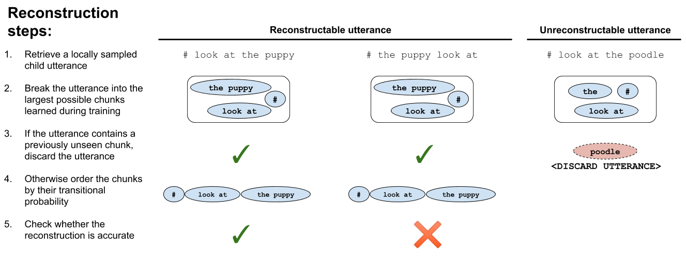

<!--Note!!: for word output, change references where not correct; initials, ampersands, parentheses-->

```{r setup, message=FALSE}
library("papaja")
library(tidyverse)
library(lme4)
library(grid)
library(gridExtra)
library(stringr)
library(jtools)
library(lattice)
library(plotrix)
```

```{r globals-and-helpers, message=FALSE}
# Seed for random number generation
set.seed(42)
knitr::opts_chunk$set(cache.extra = knitr::rand_seed)

rawdata.local.path <- "data/main/local/"
rawdata.cumulative.path <- "data/main/cumulative/"
childuttdata.path <- "data/main/childutt/"
suppl.rawdata.local.path <- "data/suppl/local/"
suppl.rawdata.cumulative.path <- "data/suppl/cumulative/"
model.inputdata.local.path <- "model_input/localsampledcorpus/"
model.inputdata.cumulative.path <- "model_input/cumulativesampledcorpus/"
plot.path <- "plots/"

child.names <- "(Alex)|(Naima)|(Ethan)|(Lily)|(Violet)|(William)"
caregiver.files <- "caregivers_[A-Z]"
child.files <- "child[A-Z]"

basic.theme <- theme(
  panel.background = element_rect(
    fill = "transparent",colour = NA),
  panel.grid.major = element_line(colour = "grey95"),
  panel.grid.minor = element_blank(),
  plot.background = element_rect(
    fill = "transparent",colour = NA),
  legend.background = element_rect(
    fill="transparent"),
  legend.text = element_text(size=10),
  legend.title = element_text(size=10),
  legend.key.height = unit(2, "lines"),
  legend.key = element_rect(colour = NA, fill = NA),
  axis.text.x = element_text(size=10, angle=45, hjust=1),
  axis.title.x = element_text(size=10),
  axis.text.y = element_text(size=10),
  axis.title.y = element_text(size=10),
  strip.text = element_text(size=10),
  panel.spacing = unit(2, "lines"))

# Function to combine two plot that share a legend
grid_arrange_shared_legend <- function(..., ncol = length(list(...)),
  nrow = 1, position = c("bottom", "right")) {
  plots <- list(...)
  position <- match.arg(position)
  g <- ggplotGrob(plots[[1]] + 
      theme(legend.position = position))$grobs
  legend <- g[[which(sapply(g, function(x) x$name) == "guide-box")]]
  lheight <- sum(legend$height)
  lwidth <- sum(legend$width)
  gl <- lapply(plots, function(x) x +
      theme(legend.position = "none"))
  gl <- c(gl, ncol = ncol, nrow = nrow)
  combined <- switch(position,
    "bottom" = arrangeGrob(do.call(arrangeGrob, gl), 
      legend,ncol = 1,
      heights = unit.c(unit(1, "npc") - lheight, lheight)),
    "right" = arrangeGrob(do.call(arrangeGrob, gl),
      legend, ncol = 2,
      widths = unit.c(unit(1, "npc") - lwidth, lwidth)))
  grid.newpage()
  grid.draw(combined)
  # return gtable invisibly
  invisible(combined)
}

# Function to remove the x-axis of the right-hand side graph without distorted graph sizes, 
# the x-axis is the same as the x-axis of the left-hand side graph
arrange_related_x_axes <- function(..., nrow=NULL, ncol=NULL, as.table=FALSE,
  main=NULL, sub=NULL, plot=TRUE) { 
  dots <- list(...) 
  n <- length(dots) 
  if(is.null(nrow) & is.null(ncol)) { nrow = floor(n/2) ; ncol = ceiling(n/nrow)} 
  if(is.null(nrow)) { nrow = ceiling(n/ncol)} 
  if(is.null(ncol)) { ncol = ceiling(n/nrow)} 
  fg <- frameGrob(layout=grid.layout(nrow,ncol)) 
  ii.p <- 1 
  for(ii.row in seq(1, nrow)){ 
    ii.table.row <- ii.row       
    if(as.table) {ii.table.row <- nrow - ii.table.row + 1} 
    for(ii.col in seq(1, ncol)){ 
      ii.table <- ii.p 
      if(ii.p > n) break 
      fg <- placeGrob(fg, ggplotGrob(dots[[ii.table]]), 
                      row=ii.table.row, col=ii.col) 
      ii.p <- ii.p + 1 
    } 
  } 
  if(!is.null(main) | !is.null(sub)){ 
    g <- frameGrob() # large frame to place title(s) and content 
    g <- packGrob(g, fg) 
    if (!is.null(main)) 
      g <- packGrob(g, textGrob(main), side="top") 
    if (!is.null(sub)) 
      g <- packGrob(g, textGrob(sub, gp=gpar(fontsize=10),
        vjust=-1, hjust=0), side="bottom") 
  } else { 
    g <- fg 
  } 
  if(plot) grid.draw(g) 
  invisible(g) 
} 

```

```{r prep-data, message=FALSE}
# Local input
filenames <- list.files(path = rawdata.local.path,
  pattern="*productiontask-modified.csv")
local.data.list <- lapply(paste0(
  rawdata.local.path,filenames),
  na.strings=c("NaN","Nan"),
  stringsAsFactors = FALSE,read.csv)
local.data <- do.call(rbind, local.data.list)
# overwrite utterance number to avoid double numbers
local.data$num = 1:nrow(local.data)
# convert age variable to numeric values and months into years
local.data$age <- gsub("_", ".", local.data$age) 
local.data$age <- gsub("6", "5", local.data$age)
local.data$age <- as.numeric(local.data$age)
local.data <- subset(local.data, select = c(2:13))

# Cumulative input
filenames <- list.files(path = rawdata.cumulative.path,
  pattern="*productiontask-modified.csv")
cumu.data.list <- lapply(paste0(
  rawdata.cumulative.path,filenames),
  na.strings=c("NaN","Nan"),
  stringsAsFactors = FALSE,read.csv)
cumu.data <- do.call(rbind, cumu.data.list)
# overwrite utterance number to avoid double numbers
cumu.data$num = 1:nrow(cumu.data)
# convert age variable to numeric values and months into years
cumu.data$age <- gsub("_", ".", cumu.data$age)
cumu.data$age <- gsub("6", "5", cumu.data$age)
cumu.data$age <- as.numeric(cumu.data$age)
cumu.data <- subset(cumu.data, select = c(2:13))

# Child utterances
filenames <- list.files(path=childuttdata.path,
  pattern="*.txt")
childutt.data <- NULL
for (file in filenames){
  temp.data <- read.delim(paste0(childuttdata.path, file))
  colnames(temp.data) <- c("utterance")
  temp.data$child <- unlist(strsplit(unlist(
    strsplit(file, "_age"))[1],"child"))[2]
  temp.data$age <- unlist(strsplit(unlist(
    strsplit(file, "_age"))[2],".txt"))
  childutt.data <- rbind(childutt.data,temp.data)
}
# convert age variable to numeric values and months into years
childutt.data$age <- gsub("_", ".", childutt.data$age)
childutt.data$age <- gsub("6", "5", childutt.data$age)
childutt.data$age <- as.numeric(childutt.data$age)
childutt.data$numwords <- str_count(childutt.data$utterance," ")

```

During the first few years of life children learn the basic building blocks of the language(s) around them. One way they do so is via statistical learning (SL), the process of extracting  regularities present in the language environment. Over the past few decades, SL has become a major topic in the field of first language acquisition, ranging in application from speech segmentation [@jusczyk1995infants; @saffran1996statistical] and phonotactic learning [@chambers2003infants] to producing irregulars [@arnon2011brush], discovering multi-word structures [@bannard2009modeling; @chang2006using; @frost2019], and much more (see @saffran2018infant for a recent review). By its nature, work in this domain is heavily concerned with at least two major topics: (1) the information available in children's language environments (the 'input') from which they can pick up on patterns, and (2) the precise mechanisms by which children convert these 'raw' environmental statistics into internalized knowledge about language. A third issue is whether and how children's SL behavior changes as they develop [@shufaniya2018statistical]. The current paper taps into each of these three issues: we train a computational model on a longitudinal corpus of child-caregiver interactions to test whether one proposed SL mechanism---backward transitional probability [BTP; @perruchet2008role]---is able to predict children's speech productions with stable accuracy as they get older.

## SL over development

The ability to detect and store patterns in the environment begins in infancy [e.g., @johnson2009abstract; @kidd2018individual; @saffran1996statistical; @teinonen2009statistical], continues into adulthood [e.g., @conway2010implicit; @frost2016simultaneous; @saffran1999statistical], and crosses a range of modalities [@conway2005modality; @emberson2011timing; @monroy2017toddlers]. However, it is still a matter of debate whether SL is an age-invariant skill or not [@arciuli2011statistical; @raviv2018developmental; @shufaniya2018statistical; @saffran1997incidental]. Recent work that investigates SL abilities in 5--12-year-old children suggests that, while both visual and auditory SL improve with age for non-linguistic stimuli, performance stays the same across childhood for linguistic stimuli [@raviv2018developmental; @shufaniya2018statistical]. From this finding, the authors conclude that SL for language might be age-invariant. On the other hand, infant SL abilities do appear to shift within the first year, both for linguistic [@kidd2018individual] and non-linguistic [@johnson2009abstract] stimuli. For example, while 11-month-olds can detect and generalize over regularities in a sequence, 8-month-olds are only capable of detecting the regularities, and neither group succeeds yet at learning visual non-adjacent dependencies (Johnson et al., [-@johnson2009abstract]; see also Bulf, Johnson, & Valenza, [-@bulf2011visual], and Slone & Johnson, [-@slone2015infants]).

These changes in SL **ability** during infancy and early childhood may relate to changes in other fundamental cognitive skills. For example, SL-relevant brain regions, such as the pre-frontal cortex, continue maturing through childhood [@casey2000structural; @diamond2002normal; @rodriguez2009neurophysiological; @uylings2006development], which may change how children attend to the linguistic information around them as they get older. Similarly, infants' long-term memory continuously improves between ages 0;2 and 1;6 [@bauer2005developments; @wojcik2013remembering]. Therefore, the manner in which they store linguistic regularities in long-term memory may also shift during this period. Relatedly, working memory and speed of processing change continuously throughout early childhood [@gathercole2004structure; @kail1991developmental], implying that there could be a developmental change in the rate and scale at which children can process chunks of information from the unfolding speech signal.

Continued exposure to linguistic input itself can also be an impetus for change in SL **ability**---a view supported by multiple, theoretically distinct, approaches to early syntactic learning. For example, @yang2016price proposes that children gather detailed, exemplar-based statistical evidence until it is more cognitively efficient for them to make a categorical abstract generalization. He proposes that, at that point, the learner instantiates a rule to account for patterns in the data. Usage-based theories of early language development **alternately** propose that children first learn small concrete linguistic sequences from their input that are made up of specific words or word combinations (e.g., 'dog' and 'I wanna'; or multi-word combinations, 'where's the ...'; @tomasello2006acquiring). Then, over time, children are proposed to form abstract schemas centered on lexical items (see also @bannard2009modeling and @chang2006using). This representational shift, from probabilistic and lexical to abstract and syntactic, is used to account for how children can eventually create utterances that they have never heard before. Crucially, the representational shift implies a change in the way children apply the original SL mechanism(s) to incoming linguistic information [see also @lany2008twelve].

Change in SL **ability** following further linguistic experience is also predicted in models that do not assume abstraction. In chunk-based models of language learning [@arnon2017; @christiansen2016now; @christiansen2017more; @clair2010learning; @misyak2012statistical], children use statistical dependencies in the language input (e.g., between words or syllables) to store chunks of co-occurring forms. Dependencies between the chunks themselves can also be tracked **with** continued exposure and chunk storage **[see, e.g., @jost201610]**. **In this case, the development of a detailed chunk inventory can gradually change overt SL performance. **Fundamentally, however, **this apparent change in SL still comes through the use of the original** underlying mechanisms [@misyak2012statistical]**;** there is no **qualitative change in how the system processes data**, and the mechanisms for processing, storing, and deploying information stay the same.

We investigated the possibility of developmental change in SL using computational modeling, which enables us to define and test the goodness-of-fit for any given learning mechanism on a dataset of natural speech. We chose to use a longitudinal child language dataset, in which the same children were tracked across the developmental period of interest for early speech production (1;0--4;0). By choosing data in this age range, we could test whether use of a learning mechanism changed for each child across the studied developmental time points. We tested for developmental change in the use of a single proposed statistical learning mechanism: backward transitional probability [@mccauley2011learning; @onnis2013language; @pelucchi2009learning; @perruchet2008role].

## BTP and the Chunk-Based Learner

Our model is based on McCauley and Christiansen's [-@mccauley2011learning; -@mccauley2014acquiring] Chunk-Based Learner (CBL) model, which uses one measure---backward transitional probability **[BTP; @perruchet2008role]**---to detect statistical dependencies in the speech stream. **Backward transitional probability is one of multiple approaches for dividing streams of continuous speech into meaningful units; other approaches include, for example, forward transitional probability and memory-based chunking [@mareschal2017tracx2; @onnis2013language; @french2011tracx; @pelucchi2009learning; @perruchet2008role; @aslin1998computation; @perruchet1998parser; @saffran1996statistical; @cleeremans1993mechanisms<!--; see @frostInPressinsights for a review-->].** BTP for a given pair of words is defined as the occurrence probability of the previous word (w$_{-1}$) given the current word (w$_0$). It can be estimated for each word in a sentence in order to reveal peaks and dips in transitional likelihood, which reflect places where words are likely (peaks) or unlikely (dips) to co-occur.

``` {r fig1, echo=FALSE, fig.cap="Example of a sentence with BTP between consecutive words. Chunks are split at points of low BTP (indicated by the vertical lines). \"\\#\" denotes a start-of-utterance marker.", out.width = '75%', message=FALSE}

```

The CBL model divides utterances into chunks, splitting the utterances whenever the BTP between two words drops below the running average BTP. In the example in [Figure 1](#fig1), the CBL might decide to split the sentence ("did you look at the doggy") into three chunks 'did you', 'look at', and 'the doggy', and store all three in its memory. As it sees more sentences, it would continue to add new chunks and track how often they co-occurred. **Once stored in memory, the chunks are not forgotten.**

The CBL was developed to model children's early speech production and comprehension without appealing to abstract grammatical categories. Specifically, it was designed as an implementation of the hypothesis that children detect and store multi-word chunks using BTP, and also use the stored chunks to parse speech and produce new utterances (see also @arnon2010more and @bannard2008stored). The model's ability to simulate learning can be measured by first training it on what children hear and then having the model reproduce what children say from the chunks that it learned.

<!--MC: justify why the authors have chosen to focus more exclusively on BTPs, with broader framing perhaps, to help pull outside readers into the importance of the work and the reasons for the current scope of the work-->
We chose to build on the CBL model because it has successfully accounted for production data in multiple corpora, including **child language** datasets. For example: (a) it parsed text better than a shallow parser in three different languages (English, German and French) when using individual words rather than word classes, (b) it was able to recreate up to 60% of child utterance productions in 13 different languages, and (c) it closely replicated data from an artificial grammar learning study [@mccauley2011learning; @saffran2002constraints]. The model has also been able to replicate experimental data on children's multi-word utterance repetitions [@bannard2008stored], over-regularization of irregular plural nouns [@arnon2011brush], and L2-learner speech [@mccauley2017computational; see also @mccauley2014reappraising]. In sum, the CBL model appears to robustly predict the word-chunk patterns in children's speech when given information about what they hear in their input. **We extend this work by testing how the model performs with longitudinal data; it is not yet known how well it functions as a predictor of what children can say as they become more linguistically sophisticated.**

## Testing for change with age
Following McCauley and colleagues [-@mccauley2011learning; -@mccauley2014acquiring; -@mccauley2019languagelearning] we tested the CBL model's ability to learn language by checking how well it can reconstruct children's utterances from the chunks discovered in their caregivers' speech. As we are interested in developmental change over the first three years of speech production, we analyzed the model's reconstruction ability with two measures:

* "Uncorrected": The binary (success/fail) reconstruction score originally used by McCauley and colleagues [-@mccauley2011learning; -@mccauley2014acquiring; -@mccauley2019languagelearning].
* "Corrected": A length-and-repetition-controlled reconstruction score that accounts for the fact that longer utterances have more opportunities for error reconstruction, and for the fact that some child utterances contain repetitions of **chunks**, making multiple reconstructions match the original utterance.

**If BTP is an age-invariant mechanism, it should apply equally well across age. However, because children's utterances get longer as they get older, we would expect age invariance to only hold when we correct for utterance length.** We therefore test for age invariance both with the original binary ("uncorrected") reconstruction score and a new ("corrected") score we propose to account for utterance length and word repetitions. If we find age-invariance, even while controlling for utterance length and word repetitions, it would strongly suggest that the mechanism is stable over the first three years of speech production and not simply influenced by other factors, e.g., utterance length. If not, it would suggest that use of the mechanism, in fact, changes with age [@bannard2009modeling; @tomasello2003constructing; @yang2016price].

## Predictions
**With these** previous findings as a starting point, we investigated whether the CBL could account for child speech production with equal precision over the first four years of life. **Taking for granted that children _eventually_ develop abstract representations [as in, e.g., @tomasello2006acquiring; @yang2016price], w**e predicted that:

* The CBL would less accurately generate children's speech productions as they grew older; given the assumption that children gradually learn to abstract over the specific "chunks" they encounter [@bannard2009modeling; @tomasello2003constructing; @yang2016price] and, therefore, their speech should less often directly mirror their linguistic input at later ages. This finding would indicate that the immediate influence of children's language input statistics on their speech production decreases across development.
* Children will be more likely to use words that are not documented in the caregiver speech as they get older. These words could originate from other sources, such as peer speech or non-recorded caregiver speech [@hoff2010context; @roy2009exploring; @hoff1991older; @mannle1992twoyearolds].
* Younger children's utterances would be reconstructed well on the basis of recently heard speech alone, whereas older children's utterances would be best constructed when considering a longer period of their historical input. Our reasoning was that older children's increased memory capacity [@bauer2005developments; @gathercole2004structure; @wojcik2013remembering] allows them to draw on older input more easily in producing speech. If so, the findings would suggest that memory plays a critical role in the use of the same learning mechanism with age.

In sum, we expected to find that the CBL's ability to reconstruct children's speech decreases in-line with a concomitant increase in children's linguistic sophistication; an effect driven by children's use of more abstracted representations, words from other speech sources, and their increased ability to use historical input.

# Methods

## Model

The CBL model [@mccauley2011learning] is an incremental computational model of language acquisition, that explores the possibility that infants and children parse their input into (multi-word) chunks during the process of acquiring language. 

The model takes transcribed speech as input and divides the transcribed utterances into multi-word chunks. Each utterance begins with a start cue (denoted "\#"). The exact placement of a chunk boundary within an utterance is determined by two factors: (1) the backward transitional probability (BTP) between consecutive words in the utterance, and (2) the inventory of already-discovered chunks. All newly discovered chunks are saved into the inventory, alongside the BTPs associated with each chunk. **The model tracks and stores:** the discovered chunks, the BTPs between words, and the BTPs between discovered chunks.  For example, the model might parse the utterances "I see the puppy" and "did you look at the puppy?" into five different chunks, namely "I", "see", "the puppy", "did you", and "look at" based on the BTPs between these words compared to the average BTP found in the corpus so far.

## Child utterance reconstruction task

Once the model has been trained on adult utterances, and thereby has discovered chunks in the adults' speech, we can test whether it closely matches the linguistic structures produced by the children in the same caregiver-child corpus. Following @mccauley2011learning, we use a child utterance reconstruction task to test whether the chunk statistics present in the adults' utterances are also present in the child's utterances. The model reconstructs the child utterances from the chunks and their related BTPs from the adult's utterances at the same age point. This reconstruction **process, which is slightly different from McCauley and Christiansen's (2011) process,** is done in two steps (see [Figure 2](#fig2)). First, a child utterance is converted into an unordered bag-of-chunks containing **the set of largest possible** chunks **that had already been seen** in the adults' speech, in line with the bag-of-words approach proposed in @chang2008automatic. Whenever the model encounters a word in the child utterance that is not present in the adult-based chunk inventory, it stops processing that utterance.^[@mccauley2011learning handle these cases differently**. Our CBL implementation is identical to theirs up to this point. Therefore we also** provide sentence reconstruction scores using their original method in the Supplementary Materials.] For instance, in the toy example in [Figure 2](#fig2), the child utterance "look at the puppy" would be **broken down into a** set of **known** chunks which were discovered in the adults' speech **(e.g.,  "look at" and "the puppy", as in the step 2 speech bubble). I**f the utterance were "look at the **poodle**", and the model had **not already added a** chunk for the word "poodle" **during training, then the word is unknown to the model and the utterance cannot be reconstructed; therefore the utterance would be rejected from further processing.** **However, in the case that the utterance _can_ be broken down into known chunks, the model then** tries to reconstruct **the utterance by shuffling the chunks detected and reordering them based on their known transitional probabilities:** the model begins with the utterance start cue and then **finds the chunk that has the highest backwards transitional probability to the start cue, following that first chunk with the next one, which will be the remaining chunk with the highest backwards transitional probability to the first chunk, and again and again, until the set of chunks for that utterance is exhausted.** So, the set of chunks "look at" and "the puppy" would be ordered depending on **the chunk that maximizes the BTP of the start cue (i.e., “look at”), followed by the chunk that maximizes the BTP of "look at" (i.e., "the puppy")**.

``` {r fig2, echo=FALSE, fig.cap="Example of reconstruction attempts for three child utterances. The model tries to reconstruct the first two utterances using transitional probabilities of the chunks it finds, but it cannot do so with the third utterance, which contains a word  (\"poodle\") that had not been previously seen during training.", out.width = '99%', message=FALSE}
# https://docs.google.com/drawings/d/1dOj8K43pmSYdWTx2tfILOL95J5qz-fcnfB2CS7dIl2c/edit?usp=sharing

```

## Materials and Procedure

As input to the model we used transcripts of 1--2-hour recordings of at-home interaction between six North American children and their caregivers who were recorded approximately every two weeks between ages 1;0 and 4;0 (the Providence corpus; @demuth2006word). We pre-processed the transcripts, which were formatted using CHAT conventions [@childes], such that the input to the model only contained plain text orthographic transcriptions of what was said.^[All punctuation marks, grammatical notes, omitted word annotations, shortenings, and assimilations were removed from the utterances, such that only the text representing the spoken words of the utterance remained.] We split the transcripts into two separate files, one with all the caregivers' utterances and one with all the child's utterances. Our pre-processing also added a "\#" prefix to the start of each utterance.

The transcripts were sampled at approximate 6-month intervals between ages 1;0 and 4;0. We used two different sampling methods: a local data sampling method and a cumulative data sampling method. With the local data sampling method we selected data within a two-month interval around each age point. For example, for age point 1;6 we selected transcripts in which the child was between 1;5.0 and 1;6.31 years of age. This method led to ~800--4000 caregiver utterances at each age point. By design, the local sampling method focuses the model's training solely on _recent_ linguistic input so that, when it tries to reconstruct children's utterances, the result is a test of how closely their current speech environment can account for what they say. **We sample _around_ target age points and not _up-until_ target age points because, while the Providence corpus is relatively densely sampled, recording sessions weren't frequent enough to guarantee a representative picture of each child's input in the month preceding each of the target age points. For this reason, we decided that training the model on input proximal to the tested age was a better method for getting a broad, but age-specific model of adult speech for each child at each age point.**

In contrast, the cumulative sampling method focuses the model's training on all previously heard linguistic input so that, when it tries to reconstruct children's utterances, the result is a test of how closely their current _and_ previous speech environments can account for what they say. For the cumulative sample we selected data for each age point by taking all the available transcripts up to that age point. For example, for age 1;6 we selected all transcripts in which the child was 1;6 or younger. This method led to ~800--60,000 caregiver utterances across the different age points, with the number of caregiver utterances increasing (i.e., accumulating) with child age. As a consequence, the cumulative sample always contained more caregiver utterances than the local sample, except at age 1;0, the first sampled age point.

While we used two different sampling methods for training the model on adult data, all child utterances used for the reconstruction task were retrieved using the local sampling method for that particular age point. In other words, we only reconstructed the child utterances local to each tested age, regardless of the training strategy.

## Analysis

We modeled two primary scores related to utterance reconstruction: the uncorrected (binary: success/fail) reconstruction score used by McCauley and colleagues [-@mccauley2011learning; -@mccauley2014acquiring; -@mccauley2019languagelearning] and the corrected reconstruction score we introduce in the current paper. The uncorrected reconstruction score (1: success, 0: fail) was computed for all child utterances that could be decomposed into previously seen chunks (see steps 4 and 5 in [Figure 2](#fig2)). The corrected reconstruction score (defined below) was computed for the same set of utterances. We additionally included a third analysis: the likelihood that **a word encountered during the reconstruction task was not seen during training; utterances with unseen words**, by our version of the CBL, cannot be reconstructed (see step 3 in Figure [Figure 2](#fig2)).

We used mixed-effects regression to analyze the effect of child age on both of the reconstruction scores and also whether **a word encountered during the reconstruction task was not encountered during training. All mixed-effects models included child age as a fixed effect and by-child random intercepts with random slopes of child age. By default, child age was modeled in years (1--4) so that the intercept reflects a developmental trajectory beginning at age 0. However, for the model of corrected reconstruction accuracy we had the additional advantage of being able to test whether the CBL performance significantly exceeded the baseline chance of correct reconstruction. We tested this difference at the average age in our longitudinal dataset (2;6) by centering age on zero in the statistical model (ages 1;0--4;0 are re-coded numerically as -1.5--1.5) such that the default model output would reflect the estimated difference from chance at the middle point of our age range.**

All analyses were conducted using the `lme4` package [@lme4] and all figures were generated with the `ggplot2` package in `R` [@ggplot2; @R]. All code used to create the model and analyze its output is available at [https://osf.io/ca8ts/](). **Full tables of statistical model output are available in the Supplementary Materials.** Before turning to the main results we briefly describe the corrected reconstruction score and the analysis of previously unseen words in more detail.
<!--
% for the final version: https://github.com/marisacasillas/CBL-Roete
-->

## Corrected reconstruction accuracy

The corrected, length-and-repetition-controlled reconstruction score is a function of three factors: (a) whether the model successfully reconstructed the child utterance or not, (b) the number of chunks used to reconstruct the utterance, and (c) the number of duplicate chunks involved in the reconstruction. By taking the number of chunks into account, this reconstruction score compensates for the fact that successful reconstruction is less likely for longer utterances. When an utterance contains duplicate chunks, the exact ordering of those duplicate chunks does not influence the correctness of the reconstruction. For example, if the utterance "I wanna, I wanna" is decomposed into the two chunks "I wanna" and "I wanna", it does not matter which of the two "I wanna" chunks is placed first when calculating the reconstruction accuracy of the utterance. Thus, utterances containing duplicate chunks are more likely to be reconstructed by chance alone than utterances with the same number of chunks **but** no duplicates. **Note that here we are detecting duplicate _chunks_ in the utterance rather than duplicate _words_. At this post-training stage, the model is only able to parse the utterance into chunks; that is the relevant unit over which duplication may affect reconstruction accuracy.**

An utterance that is decomposed into $N$ unique chunks can be reconstructed in $N!$ different orders. Hence, the **baseline probability of obtaining the correct order of $N$ unique chunks equals** $1/N!$. When we take into account that chunks can be repeated within an utterance, chance **level** equals $(n_1!n_2!\ldots n_k!)/N!$, where $N$ is the total number of chunks in the utterance, and $n_1,\ldots,n_k$ are the number of times a chunk is repeated for each of the $k$ unique chunks found in the utterance ([Figure 3](#fig3)). 

``` {r fig3, echo=FALSE, fig.cap="Corrected reconstruction score for correct (left; positive values) and incorrect (right; negative values) reconstructions, as a function of utterance length (2--6 chunks). In this example, either no chunks are repeated (black/solid lines) or one chunk occurs twice in the utterance (gray/dashed lines).", out.width = '95%', fig.height=3, message=FALSE}
N <- rep(2:6, 4)
Reconstruction <- c(
  rep("Correct reconstruction",10),
  rep("Incorrect reconstruction",10))
Repeated <- c(
  rep("no chunk repeated",5),
  rep("one chunk repeated",5),
  rep("no chunk repeated",5),
  rep("one chunk repeated",5))
Score <- c(
  -log(1/factorial(2:6)),
  -log(2/factorial(2:6)),
  log(1-1/factorial(2:6)),
  NA,
  log(1-2/factorial(3:6)))
score_data <- data.frame(N, Reconstruction,
  Repeated, Score)

corrected_recon_acc <- ggplot(data = score_data,
  aes(N, Score, color=Repeated, linetype=Repeated, shape=Repeated)) +
  facet_wrap(~Reconstruction,
    nrow=1, scales="free_y") +
  geom_line(size=.8) +
  geom_point(size=2) +
  scale_color_manual(values = c("black", "gray40")) +
  xlab("Utterance length") +
  ylab("Reconstruction score") +
  theme(legend.title = element_blank()) +
  theme(legend.position = "top") +
  basic.theme

corrected_recon_acc
```

When probability of reconstruction was lower, we scored a correctly reconstructed utterance higher. We assigned a score of $-\log(chance)$ for each correct reconstruction and $\log(1-chance)$ for each incorrectly reconstructed utterance. In layman's terms, this means that successfully reconstructed utterances were scored positively, but were weighed relative to the number of chunks and the number of repetitions they had, such that reconstructions of long utterances were given higher scores than reconstructions of short utterances. Along the same lines, incorrectly reconstructed utterances were scored negatively and were also weighed relative to the number of chunks they had, such that incorrect reconstructions of long utterances were given higher (i.e., less negative) scores than incorrect reconstructions of short utterances.

To illustrate the corrected scoring method, let's compare two three-chunk utterances, one of which contains a duplicate chunk: "I wanna I wanna see" (chunks: "I wanna", "I wanna", "see") and "I wanna see that" (chunks: "I wanna", "see", "that"). For the first utterance, chance level equals $(2!\times1!)/(3!)$: The numerator is determined by the number of times each unique chunk is used, so because "I wanna" occurs two times and "see" occurs once, that is $2!\times1!$. The denominator is determined by the factorial of total number of chunks (here: $3! = 3\times2\times1$). The resulting chance level is then $2/6$. For the second utterance, chance level equals $(1!\times1!\times1!)/(3!)$: The numerator is equal to $1!\times1!\times1!$ here because all chunks occur only once in the utterance. The denominator is the same as for the first utterance as the total number of chunks in the utterance is the same. Here, the resulting chance level is $1/6$. If the utterances are reconstructed correctly, the score is computed by $-\log(chance)$. So, the first utterance would get a positive score of $-\log(chance) = -\log(2/6) \approx 1.098$ and the second utterance would get a higher positive score of $-\log(chance) = -\log(1/6) \approx 1.791$ for increased reconstruction difficulty. If the utterances are reconstructed incorrectly, the score is computed by $\log(1-chance)$. Thus, the first utterance would get a negative score of $\log(1-chance) = \log(1-(2/6)) \approx -0.405$ and the second utterance would get a less negative score of $\log(1-chance) = \log(1-(1/6)) \approx -0.182$. 

## Previously unseen words
Our third analysis focused on **the likelihood that words used in the child utterances were seen during training, given child age and sampling type. To prepare for this analysis we marked each word used by each child at each age point as having been seen during training (1) or not (0), given local and cumulative sampling.**

# Results

``` {r uncorr_reconstr_acc, message=FALSE}
#---- MODELS AND DESCRIPTIVE DATA ----

# Local input
# Select subset of the data, excluding all skipped utterances,
# and generate binary reconstruction score:
# Yi,j,k for the i-th utterance of the j-th child at age k:
# Y = 1 if utterance is correctly reconstructed, Y = 0 if not. 
subset.local.data <- subset(
  local.data, select=c(
    1,3,4,5,6,10,11,12))
subset.local.data$Y <- ifelse(
  subset.local.data$reconstructed == "True", 1,0)
subset.local.data <- subset(
  subset.local.data, subset.local.data$skipped == "False")
# Descriptive statistics
local_means_uncorrected_by_child <- aggregate(
  subset.local.data$Y,
  by = c(list(child = subset.local.data$child)),
  FUN = mean)
local_mean_of_means_uncorrected <- mean(
  local_means_uncorrected_by_child$x)*100
local_min <- min(local_means_uncorrected_by_child$x)*100
local_max <- max(local_means_uncorrected_by_child$x)*100

# Model with the binary uncorrected score as dependent variable,
# age as independent variable (fixed effect), by-child random intercept
# and random slopes of age.
model_local_uncorrected <- glmer(
  Y ~ age + (age|child),
  family=binomial(link = 'logit'),
  data = subset.local.data)
# sink(paste0(plot.path,"local_uncorrected_reconstruction.txt"))
# summary(model_local_uncorrected)
# sink()
# summary(model_local_uncorrected)
# ranef(model_local_uncorrected)

# Cumulative input
# Select subset of the data, excluding all skipped utterances,
# and generate binary reconstruction score:
# Yi,j,k for the i-th utterance of the j-th child at age k:
# Y = 1 if utterance is correctly reconstructed, Y = 0 if not.
subset.cumu.data <- subset(
  cumu.data, select=c(1,3,4,5,6,10,11,12))
subset.cumu.data$Y <- ifelse(
  subset.cumu.data$reconstructed == "True", 1,0)
subset.cumu.data <- subset(
  subset.cumu.data, subset.cumu.data$skipped == "False")
# Descriptive statistics
cumu_means_uncorrected_by_child <- aggregate(
  subset.cumu.data$Y,
  by = c(list(child = subset.cumu.data$child)),
  FUN = mean)
cumu_mean_of_means_uncorrected <- mean(
  cumu_means_uncorrected_by_child$x)*100
cumu_min <- min(cumu_means_uncorrected_by_child$x)*100
cumu_max <- max(cumu_means_uncorrected_by_child$x)*100

# Model with the binary uncorrected score as dependent variable,
# age as independent variable (fixed effect), by-child random intercept
# and random slopes of age.
model_cumu_uncorrected <- glmer(
  Y ~ age + (age|child),
  family=binomial(link = 'logit'),
  data = subset.cumu.data)
# sink(paste0(plot.path,"cumu_uncorrected_reconstruction.txt"))
# summary(model_cumu_uncorrected)
# sink()
# summary(model_cumu_uncorrected)
# ranef(model_cumu_uncorrected)


#---- PLOTS ----

# Utterances containing repetitions

## Local input
subset.local.data$num_repetition <- ifelse(
  subset.local.data$repetition == "True", 1,0)
plot1.local.data <- aggregate(
  subset.local.data$num_repetition,
  by = c(list(age=subset.local.data$age)),
  FUN = sum)
colnames(plot1.local.data)[2] <- "total_num_repetitions"
plot1.local.data.temp <- aggregate(
  subset.local.data$num_repetition,
  by = c(list(age = subset.local.data$age)),
  FUN = function(x){NROW(x)})
colnames(plot1.local.data.temp)[2] <- "total_num_utterances"
plot1.local.data<- merge(
  plot1.local.data, plot1.local.data.temp, by = c("age"))
plot1.local.data$percentages <- (plot1.local.data$total_num_repetitions/
    plot1.local.data$total_num_utterances)*100
plot.local.repetitions_perc_collapsed <- ggplot(
  plot1.local.data,
  aes(x=age, y = percentages)) + 
  geom_line(size = 1.5) + basic.theme +
  theme(axis.text.x = element_text(size=10)) + 
  coord_cartesian(ylim=(c(0,100))) + 
  xlab("\nAge (years)") + 
  ylab("Percentage of utterances\n containing repetitions\n") + 
  basic.theme + theme(axis.text.x = element_text(size=10)) + 
  theme(plot.title = element_text(size=10, face = "bold.italic",
    hjust = 0.5, margin=margin(b = 30, unit = "pt")))
# ggsave(paste0(
#   plot.path, "plotlocalrep_perc_collapsed.png"),
#   plot = (plot.local.repetitions_perc_collapsed+theme_apa()))

## Cumulative input
subset.cumu.data$num_repetition <- ifelse(
  subset.cumu.data$repetition == "True", 1,0)
plot1.cumu.data <- aggregate(
  subset.cumu.data$num_repetition,
  by = c(list(age=subset.cumu.data$age)),
  FUN = sum)
colnames(plot1.cumu.data)[2] <- "total_num_repetitions"
plot1.cumu.data.temp <- aggregate(
  subset.cumu.data$num_repetition,
  by = c(list(age = subset.cumu.data$age)),
  FUN = function(x){NROW(x)})
colnames(plot1.cumu.data.temp)[2] <- "total_num_utterances"
plot1.cumu.data <- merge(
  plot1.cumu.data, plot1.cumu.data.temp, by = c("age"))
plot1.cumu.data$percentages <- (plot1.cumu.data$total_num_repetitions/
    plot1.cumu.data$total_num_utterances)*100
plot.cumulative.repetitions_perc_collapsed <- ggplot(
  plot1.cumu.data,
  aes(x=age, y = percentages)) + 
  geom_line(size = 1.5) +
  #scale_colour_manual(name = "Child:", values = groupcolours) + 
  coord_cartesian(ylim=(c(0,100))) + 
  xlab("\nAge (years)") + 
  ylab("Percentage of utterances\n containing repetitions\n") + 
  #ggtitle("Cumulative sampling") + 
  basic.theme +
  theme(axis.text.x = element_text(size=10)) + 
  theme(plot.title = element_text(size=10, face = "bold.italic",
    hjust = 0.5, margin=margin(b = 30, unit = "pt")))
# ggsave(paste0(
#   plot.path, "plotcumulativerep_perc_collapsed.png"),
#   plot = (plot.cumulative.repetitions_perc_collapsed+theme_apa()))

# Both input types
plot.both.repetitions_perc_collapsed <- ggplot() +
  geom_line(data = plot1.local.data,
    aes(x=age, y = percentages, color = "Local")) +
  geom_line(data = plot1.cumu.data,
    aes(x=age, y = percentages, color = "Cumulative")) + 
#  geom_line(size = 1.5) +
  coord_cartesian(ylim=(c(0,30))) + 
  xlab("\nAge (years)") + 
  ylab("Percentage of utterances\n containing repetitions\n") + 
  ggtitle("Child utterance chunk repetition") + 
  guides(color = guide_legend(reverse = TRUE)) +
  basic.theme +
  theme(axis.text.x = element_text(size=10)) +
  theme(plot.title = element_text(size=10, face = "bold.italic",
    hjust = 0.5, margin=margin(b = 30, unit = "pt"))) +
  guides(color=guide_legend(title="Sample"))
# ggsave(paste0(
#   plot.path, "plotbothrep_perc_collapsed.png"),
#   plot = (plot.both.repetitions_perc_collapsed+theme_apa()))

# Correct reconstructions

## Local input
plot2.local.data <- aggregate(
  subset.local.data$Y,
  by = c(list(child = subset.local.data$child),
    list(age=subset.local.data$age)),
  FUN = sum)
colnames(plot2.local.data)[3] <- "total_num_corr_reconstructions"
plot2.local.data.temp <- aggregate(
  subset.local.data$Y,
  by = c(list(child = subset.local.data$child),
    list(age = subset.local.data$age)),
  FUN = function(x){NROW(x)})
colnames(plot2.local.data.temp)[3] <- "total_num_utterances"
plot2.local.data <- merge(
  plot2.local.data, plot2.local.data.temp,
  by = c("child","age"))
plot2.local.data$percentages <- (plot2.local.data$total_num_corr_reconstructions/
    plot2.local.data$total_num_utterances)*100
plot.local.reconstruction_perc <- ggplot(
  plot2.local.data,
  aes(x=age, y = percentages, group = child,
    linetype = child, colour = child)) + 
  geom_line(size = 1.5) +
  #scale_colour_manual(name = "Child:", values = groupcolours) + 
  coord_cartesian(ylim=(c(0,100))) + 
  xlab("\nAge (years)") + 
  ylab("Percentage correctly\n reconstructed utterances\n") + 
  ggtitle("Local sampling") + 
  basic.theme +
  theme(axis.text.x = element_text(size=10)) + 
  theme(plot.title = element_text(size=10, face = "bold.italic",
    hjust = 0.5, margin=margin(b = 30, unit = "pt")))
# ggsave(paste0(
#   plot.path, "plotlocalrecon_perc.png"),
#   plot = (plot.local.reconstruction_perc+theme_apa()))


## Cumulative input
plot2.cumu.data <- aggregate(
  subset.cumu.data$Y,
  by = c(list(child = subset.cumu.data$child),
    list(age=subset.cumu.data$age)),
  FUN = sum)
colnames(plot2.cumu.data)[3] <- "total_num_corr_reconstructions"
plot2.cumu.data.temp <- aggregate(
  subset.cumu.data$Y,
  by = c(list(child = subset.cumu.data$child),
    list(age = subset.cumu.data$age)),
  FUN = function(x){NROW(x)})
colnames(plot2.cumu.data.temp)[3] <- "total_num_utterances"
plot2.cumu.data <- merge(
  plot2.cumu.data, plot2.cumu.data.temp,
  by = c("child","age"))
plot2.cumu.data$percentages <- (plot2.cumu.data$total_num_corr_reconstructions/
    plot2.cumu.data$total_num_utterances)*100
plot.cumu.reconstruction_perc <- ggplot(
  plot2.cumu.data,
  aes(x=age, y = percentages, group = child,
    linetype = child, colour = child)) + 
  geom_line(size = 1.5) +
  coord_cartesian(ylim=(c(0,100))) + 
  xlab("\nAge (years)") + 
  ylab("Percentage correctly\n reconstructed utterances\n") + 
  ggtitle("Cumulative sampling") + 
  basic.theme +
  theme(axis.text.x = element_text(size=10)) + 
  theme(plot.title = element_text(size=10, face = "bold.italic",
    hjust = 0.5, margin=margin(b = 30, unit = "pt")))
# ggsave(paste0(
#   plot.path, "plotcumurecon_perc.png"),
#   plot = (plot.cumu.reconstruction_perc+theme_apa()))

plot2.local.data$Sample <- "Local"
plot2.cumu.data$Sample <- "Cumulative"
plot2.data <- bind_rows(plot2.local.data, plot2.cumu.data)
plot2.data$Sample <- as.factor(plot2.data$Sample)
plot2.data$Sample <- factor(plot2.data$Sample,
  levels = c("Local", "Cumulative"))
plot2.data$Child <- plot2.data$child

plot2.bysample <- ggplot(
  aes(x=age, y = percentages, group = Child,
    linetype = Child, colour = Child),
  data = plot2.data) +
  geom_line() +
  facet_grid(~ Sample) +
  xlab("Age (years)") +
  ylab("% correctly\n reconstructed utterances\n") +
  basic.theme +
  theme(
    legend.key.size = unit(0.5, "cm"),
    legend.key.height = unit(0.2, "cm"))

# png(paste(plot.path,
#   "plotbothreconstruction_perc.png", sep=""),
#   width=1500,height=700,units="px",
#   bg = "transparent")
# grid.newpage()
# arrange_related_x_axes(plot.local.reconstruction_perc.noxtitle,
#                        plot.cumu.reconstruction_perc.noxtitle,
#                        nrow=1, ncol = 2, as.table=TRUE,
#                        sub="Age (years)")
# dev.off()
```

## Uncorrected reconstruction accuracy

The uncorrected score of accurate utterance reconstruction [@mccauley2011learning; @mccauley2014acquiring] showed that **the** model's average percentage of correctly reconstructed utterances across children and age points was similar for the locally and cumulatively sampled speech (local: mean = 65.4\%, range across children = 59.9\%--70.3\%; cumulative: mean = 59.9\%, range across children = 53.1\%--68.2\%). This is similar to, or slightly higher than, results reported by @mccauley2011learning who found an average percentage of correctly reconstructed utterances of 59.8\% over 13 typologically different languages with a mean age range of 1;8--3;6 years. Additionally, @mccauley2019languagelearning reported an average reconstruction percentage of 55.3\% for 160 single-child corpora of 29 typologically different languages, including a performance of 58.5\% for 43 English single-child corpora with a mean age range of 1;11--3;10.

In our statistical models of the uncorrected reconstruction accuracy^[**accuracy ~ age + (age|child), family = binomial(link = 'logit').**], we first analyzed the CBL model's performance when it was trained on locally sampled caregiver speech. The number of correctly reconstructed utterances decreased with age ($b = -0.805, SE = 0.180, p < 0.001$); over time the BTP statistics present in the caregivers' speech were less reflected in the child's own speech ([Figure 4, left panel](#fig4))**; as we shall see, this decrease is related to the uncorrected reconstruction score**.

We then tested the model's performance when it was trained with a cumulative sample of caregiver speech, rather than just a local sample. As before, the number of correctly reconstructed utterances decreased with child age ($b=-0.821, SE = 0.146, p < 0.001$; [Figure 4, right panel](#fig4)). These results indicate age-variance for the SL mechanism; its utility for modeling children's utterances changes with age.

Importantly, however, the length of the child utterances varied quite a lot (range = 1--44 words long; mean = 2.8, median = 2), and some of them contained repetitions of chunks (e.g., "I wanna, I wanna"), both of which influence the baseline probability of accurate reconstruction. Utterances from older children tended to contain more words than utterances from younger children ([Figure 5, left panel](#fig5)). As a consequence, on average, utterances from older children are systematically less likely to be correctly reconstructed by chance, contributing to the decrease in the CBL's overall performance with age. Additionally, the percentage of child utterances that contained duplicate chunks decreased over time ([Figure 5, right panel](#fig5)). Utterances with duplicate chunks have a higher baseline probability of being accurately reconstructed by the model. So again, on average, utterances from older children were systematically more difficult, contributing to the age-related decrease in uncorrected reconstruction scores.

``` {r fig4, echo=FALSE, fig.cap="Percentage of correctly reconstructed utterances across the age range, using local (left) and cumulative (right) sampling.", out.width = '95%', fig.height=3, message=FALSE}
plot2.bysample
```

``` {r chiutt_descriptives, message=FALSE}
# Basic descriptive data on child utterances
min <- min(childutt.data$numwords)
max <- max(childutt.data$numwords)
mean <- mean(childutt.data$numwords)
median <- median(childutt.data$numwords)

#---- PLOTS ----

# Utterance length in words
plot1.data <- aggregate(
  childutt.data$numwords,
  by = c(list(age=childutt.data$age)),
  FUN=sum)
colnames(plot1.data)[2] <- "total_uttlength"
plot1.data.temp <- aggregate(
  childutt.data$numwords,
  by = c(list(age=childutt.data$age)),
  FUN = function(x){NROW(x)})
colnames(plot1.data.temp)[2] <- "total_num_utterances"
plot1.data <- merge(
  plot1.data,plot1.data.temp, by = c("age"))
plot1.data$averagelength <- (plot1.data$total_uttlength/
    plot1.data$total_num_utterances)
plot.childuttlength <- ggplot(
  plot1.data,
  aes(x=age, y = averagelength)) + 
  geom_line() +
  xlab("\nAge (years)") + 
  ylab("Average number of words \n in child utterance\n") + 
  ggtitle("Child utterance length ") + 
  basic.theme +
  theme(axis.text.x = element_text(size=10)) + 
  theme(plot.title = element_text(size=10, face = "bold.italic",
    hjust = 0.5, margin=margin(b = 10, unit = "pt")))
# ggsave(paste0(
#   plot.path, "plotchilduttlength.png"),
#   plot = (plot.childuttlength+theme_apa()))

# Percent of utterances containing repetitions x age
# (both local and cumulative as seperate lines in graph)
plot.childuttlength.noxtitle <- plot.childuttlength +
  xlab("\n") +
  ylab("Average number of words\nin child utterance\n") +
  theme(axis.text.x = element_text(size=10),
        axis.text.y = element_text(size=10))
plot.both.repetitions_perc_collapsed.noxtitle <- 
  plot.both.repetitions_perc_collapsed +
  xlab("\n") +
  ylab("\n\nPercentage of utterances\ncontaining repetitions\n") +
  theme(axis.text.x = element_text(size=10),
        axis.text.y = element_text(size=10),
        legend.position=c(0.75,0.9),
    legend.key.size = unit(0.5, "cm"),
    legend.key.height = unit(0.2, "cm"))
# png(paste(plot.path,
#   "plotbothfactors.png", sep=""),
#   width=1500,height=500,units="px",
#   bg = "transparent")
# grid.newpage()
# arrange_related_x_axes(plot.childuttlength.noxtitle,
#                        plot.both.repetitions_perc_collapsed.noxtitle,
#                        nrow=1, ncol = 2, as.table=TRUE,
#                        sub="Age (years)")
# dev.off()
```

``` {r fig5, echo=FALSE, fig.cap="Children's utterances increased in length (number of words) with age (left) while simultaneously decreasing in the number of duplicate chunks used (right).", out.width = '95%', fig.height=3, message=FALSE}
grid.arrange(plot.childuttlength.noxtitle,
  plot.both.repetitions_perc_collapsed.noxtitle, nrow=1, ncol=2)
```

``` {r corr_reconstr_acc, message=FALSE}
#---- MODELS AND DESCRIPTIVE DATA ----

# Local input
# Select subset of the data, excluding all skipped utterances,
# and generate binary reconstruction score:
# Yi,j,k for the i-th utterance of the j-th child at age k:
# Y = 1 if utterance is correctly reconstructed, Y = 0 if not. 
subset.local.data <- subset(local.data,
  select=c(1,3,4,5,6,10,11,12))
subset.local.data$Y <- ifelse(
  subset.local.data$reconstructed == "True", 1,0)
subset.local.data <- subset(
  subset.local.data, subset.local.data$skipped == "False")
# Descriptive statistics
local_means_corrected_by_child <- aggregate(
  subset.local.data$correctedscore,
  by = c(list(child = subset.local.data$child)),
  FUN = mean)
local_mean_of_means_corrected_by_child <- mean(
  local_means_corrected_by_child$x)
local_se_corrected_by_child <- aggregate(
  subset.local.data$correctedscore,
  by = c(list(child = subset.local.data$child)),
  FUN = std.error)
local_mean_of_se_corrected_by_child <- mean(
  local_se_corrected_by_child$x)
# Recenter child age
subset.local.data$recentered_age <- subset.local.data$age - 2.5
# Model with the corrected score as dependent variable,
# recentered age as independent variable (fixed effect),
# by-child random intercept and random slopes of age.
model_local_corrected <- lmer(
  correctedscore ~ recentered_age + (recentered_age|child),
  data = subset.local.data,
  control=lmerControl(optimizer = "nloptwrap",
    optCtrl=list(maxfun=1000000)))
# sink(paste0(plot.path,"local_corrected_reconstruction.txt"))
# summary(model_local_corrected)
# sink()
# summary(model_local_corrected)
# ranef(model_local_corrected)

# Cumulative input
# Select subset of the data, excluding all skipped utterances,
# and generate binary reconstruction score:
# Yi,j,k for the i-th utterance of the j-th child at age k:
# Y = 1 if utterance is correctly reconstructed, Y = 0 if not.
subset.cumu.data <- subset(cumu.data,
  select=c(1,3,4,5,6,10,11,12))
subset.cumu.data$Y <- ifelse(
  subset.cumu.data$reconstructed == "True", 1,0)
subset.cumu.data <- subset(
  subset.cumu.data, subset.cumu.data$skipped == "False")
# Descriptive statistics
cumu_means_corrected_by_child <- aggregate(
  subset.cumu.data$correctedscore,
  by = c(list(child = subset.cumu.data$child)),
  FUN = mean)
cumu_mean_of_means_corrected_by_child <- mean(
  cumu_means_corrected_by_child$x)
cumu_se_corrected_by_child <- aggregate(
  subset.cumu.data$correctedscore,
  by = c(list(child = subset.cumu.data$child)),
  FUN = std.error)
cumu_mean_of_se_corrected_by_child <- mean(
  cumu_se_corrected_by_child$x)
# Recenter child age
subset.cumu.data$recentered_age <- subset.cumu.data$age - 2.5
# Model with the corrected score as dependent variable,
# recentered age as independent variable (fixed effect),
# by-child random intercept and random slopes of age.
model_cumu_corrected <- lmer(
  correctedscore ~ recentered_age + (recentered_age|child),
  data = subset.cumu.data,
  control=lmerControl(optimizer = "nloptwrap",
    optCtrl=list(maxfun=1000000)))
# sink(paste0(plot.path,"cumu_corrected_reconstruction.txt"))
# summary(model_cumu_corrected)
# sink()
# summary(model_cumu_corrected)
# ranef(model_cumu_corrected )


#---- PLOTS ----

# Length-and-repetition controlled reconstruction score

## Local input
plot1.local.data <- aggregate(
  subset.local.data$correctedscore,
  by = c(list(child = subset.local.data$child),
    list(age=subset.local.data$age)),
  FUN = sum)
colnames(plot1.local.data)[3] <- "total_score"
plot1.local.data.temp <- aggregate(
  subset.local.data$correctedscore,
  by = c(list(child = subset.local.data$child),
    list(age = subset.local.data$age)),
  FUN = function(x){NROW(x)})
colnames(plot1.local.data.temp)[3] <- "total_num_utterances"
plot1.local.data <- merge(
  plot1.local.data, plot1.local.data.temp,
  by = c("child","age"))
plot1.local.data$averagescore <- plot1.local.data$total_score/
  plot1.local.data$total_num_utterances
plot.local.reconstruction <- ggplot(
  plot1.local.data,
  aes(x=age, y = averagescore, group = child,
    linetype = child, colour = child)) + 
  geom_line(size = 1.5) +
  coord_cartesian(ylim=(c(-0.5,0.5))) + 
  xlab("\nAge (years)") + 
  ylab("Average reconstruction \nscore\n") + 
  ggtitle("Local sampling") + 
  geom_hline(yintercept=0) +
  basic.theme +
  theme(axis.text.x = element_text(size=10)) + 
  theme(plot.title = element_text(size=10, face = "bold.italic",
    hjust = 0.5, margin=margin(b = 30, unit = "pt")))
# ggsave(paste0(
#   plot.path, "plotlocalrecon.png"),
#   plot = plot.local.reconstruction+theme_apa())

## Cumulative input
plot1.cumu.data <- aggregate(
  subset.cumu.data$correctedscore,
  by = c(list(child = subset.cumu.data$child),
    list(age=subset.cumu.data$age)),
  FUN = sum)
colnames(plot1.cumu.data)[3] <- "total_score"
plot1.cumu.data.temp <- aggregate(
  subset.cumu.data$correctedscore,
  by = c(list(child = subset.cumu.data$child),
    list(age = subset.cumu.data$age)),
  FUN = function(x){NROW(x)})
colnames(plot1.cumu.data.temp)[3] <- "total_num_utterances"
plot1.cumu.data <- merge(
  plot1.cumu.data, plot1.cumu.data.temp,
  by = c("child","age"))
plot1.cumu.data$averagescore <- plot1.cumu.data$total_score/
  plot1.cumu.data$total_num_utterances
plot.cumu.reconstruction <- ggplot(
  plot1.cumu.data,
  aes(x=age, y = averagescore, group = child,
    linetype = child, colour = child)) + 
  geom_line(size = 1.5) +
  #scale_colour_manual(name = "Child:", values = groupcolours) + 
  coord_cartesian(ylim=(c(-0.5,0.5))) + 
  xlab("\nAge (years)") + 
  ylab("Average reconstruction \nscore\n") + 
  ggtitle("Cumulative sampling") + 
  geom_hline(yintercept=0) +
  basic.theme +
  theme(axis.text.x = element_text(size=10)) + 
  theme(plot.title = element_text(size=10, face = "bold.italic",
    hjust = 0.5, margin=margin(b = 30, unit = "pt")))
# ggsave(paste0(
#   plot.path, "plotcumurecon.png"),
#   plot = plot.cumu.reconstruction + theme_apa())


plot1.local.data$Sample <- "Local"
plot1.cumu.data$Sample <- "Cumulative"
corrreconstruction.data <- bind_rows(plot1.local.data, plot1.cumu.data)
corrreconstruction.data$Sample <- as.factor(corrreconstruction.data$Sample)
corrreconstruction.data$Sample <- factor(corrreconstruction.data$Sample,
  levels = c("Local", "Cumulative"))
corrreconstruction.data$Child <- corrreconstruction.data$child


corrreconstruction.bysample <- ggplot(
  aes(x=age, y = averagescore, group = Child,
    linetype = Child, colour = Child),
  data = corrreconstruction.data) +
  geom_hline(yintercept=0) +
  geom_line() +
  coord_cartesian(ylim=(c(-0.5,0.5))) + 
  facet_grid(~ Sample) +
  xlab("Age (years)") +
  ylab("Average reconstruction \nscore\n") +
  basic.theme +
  theme(
    legend.key.size = unit(0.5, "cm"),
    legend.key.height = unit(0.2, "cm"))


# ## Both input types
# plot.local.reconstruction.noxtitle <- plot.local.reconstruction +
#   xlab("\n") +
#   ylab("Average reconstruction score\n") +
#   theme(axis.text.x = element_text(size=10),
#         axis.text.y = element_text(size=10),
#         legend.position="none")
# plot.cumu.reconstruction.noxtitle <- plot.cumu.reconstruction +
#   xlab("\n") +
#   ylab("\n") +
#   theme(legend.key.width = unit(2, "cm"),
#         axis.text.x = element_text(size=10),
#         axis.text.y = element_text(size=10),
#         legend.position=c(0.75,0.25))
# png(paste(plot.path,
#           "plotbothreconstruction.png", sep=""),
#     width=1500,height=700,units="px",
#     bg = "transparent")
# grid.newpage()
# arrange_related_x_axes(plot.local.reconstruction.noxtitle,
#                        plot.cumu.reconstruction.noxtitle,
#                        nrow=1, ncol = 2, as.table=TRUE,
#                        sub="Age (years)")
# dev.off()

```


## Corrected reconstruction accuracy

Next, we used our corrected reconstruction score to assess the model's reconstruction accuracy while controlling for utterance length and the use of duplicate chunks. **As explained above, the corrected** score weighs whether each utterance was accurately reconstructed against its chance level of reconstruction, depending on the total number of chunks and number of duplicate chunks it contains. The model's average reconstruction score across children and age points was similar for the locally and cumulatively sampled speech (local: mean = 0.10, SE = 0.01; cumulative: mean = 0.06, SE = 0.01). Note again that one aim of this analysis was to test whether the corrected reconstruction score was above chance---here represented by a score of zero---so in the statistical models we centered child age on zero so that the estimation would reflect the difference from zero for the average age in our sample (2;6).^[**accuracy ~ centered.age + (centered.age|child).**]

Again, we first analyzed the model's performance when it was trained on locally sampled caregiver speech. We found a significant positive intercept ($b = 0.11, SE = 0.02, t = 5.064$) and no significant change across age ($b = 0.030, SE = 0.018, t = 1.681$); the BTP statistics from the caregivers' speech were consistently reflected in the child's own speech ([Figure 6, left panel](#fig6)).

As before, we created a parallel set of analyses to test the model's performance when it was trained with a cumulative sample of caregiver speech. We again found a significant positive intercept ($b= 0.06, SE = 0.010, t = 6.238$) and that accuracy did not change significantly across age ($b=0.02, SE = 0.013, t = 1.590$; [Figure 6, right panel](#fig6)).

In sum, contrary to the uncorrected reconstruction accuracy analysis, these corrected reconstruction score results indicate age-invariance for the SL mechanism. In addition, the model performed significantly above chance level in both the local and cumulative sampling contexts.

``` {r fig6, echo=FALSE, fig.cap="Corrected reconstruction scores across the age range, using local (left) and cumulative (right) sampling.", out.width = '95%', fig.height=3, message=FALSE}
corrreconstruction.bysample
```

``` {r unseen-words, message=FALSE}
#---- MODELS AND DESCRIPTIVE DATA ----

# Extract all words used in the local input
local.CBL.input.filenames <- list.files(
  path = model.inputdata.local.path,
  pattern = caregiver.files)
local.input.words <- tibble()
for (file in local.CBL.input.filenames) {
  child <- str_extract(file, child.names)
  age <- as.numeric(str_replace(str_replace(str_extract(
    file, "\\d_\\d"), "_", "."), "6", "5"))
  utterances <- unique(str_replace_all(paste(read_lines(
    paste0(model.inputdata.local.path, file)),
    collapse = ""), "#", ""))
  words <- as_tibble(table(
    unlist(str_split(utterances, " ")),
    dnn = "word")) %>%
    filter(word != "") %>%
    mutate(
      child = child,
      age = age
    )
  local.input.words <- bind_rows(
    local.input.words, words)
}
local.input.words$seen_local <- 1


# Extract all words used in the cumulative input
cumulative.CBL.input.filenames <- list.files(
  path = model.inputdata.cumulative.path,
  pattern = caregiver.files)
cumulative.input.words <- tibble()
for (file in cumulative.CBL.input.filenames) {
  child <- str_extract(file, child.names)
  age <- as.numeric(str_replace(str_replace(str_extract(
    file, "\\d_\\d"), "_", "."), "6", "5"))
  utterances <- unique(str_replace_all(paste(read_lines(
    paste0(model.inputdata.cumulative.path, file)),
    collapse = ""), "#", ""))
  words <- as_tibble(table(
    unlist(str_split(utterances, " ")),
    dnn = "word")) %>%
    filter(word != "") %>%
    mutate(
      child = child,
      age = age
    )
  cumulative.input.words <- bind_rows(
    cumulative.input.words, words)
}
cumulative.input.words$seen_cumulative <- 1

# Extract all words used in the child speech
child.utt.filenames <- list.files(
  path = model.inputdata.local.path,
  pattern = child.files)
child.output.words <- tibble()
for (file in child.utt.filenames) {
  child <- str_extract(file, child.names)
  age <- as.numeric(str_replace(str_replace(str_extract(
    file, "\\d_\\d"), "_", "."), "6", "5"))
  utterances <- unique(str_replace_all(paste(read_lines(
    paste0(model.inputdata.local.path, file)),
    collapse = ""), "#", ""))
  words <- as_tibble(table(
    unlist(str_split(utterances, " ")),
    dnn = "word")) %>%
    filter(word != "") %>%
    mutate(
      child = child,
      age = age
    )
  child.output.words <- bind_rows(
    child.output.words, words)
}
child.output.words <- select(child.output.words, -n)

# Merge seen words into produced words
child.output.words.seen <- child.output.words %>%
  left_join(local.input.words) %>%
  rename(n_local = n) %>%
  left_join(cumulative.input.words) %>%
  rename(n_cumulative = n) %>%
  replace_na(list(seen_local = 0, seen_cumulative = 0))

# prev_seen = 0 or 1 depending on if they were in the training for that age+kid 
# model it as prev_seen ~ age + (age|child)

# Model with the binary seen/not seen as dependent variable,
# and age (fixed effect), and by-child random intercept and
# random slopes of age.
model_local_unseenwords <- glmer(
  seen_local ~ age + (age|child),
  family=binomial(link = 'logit'),
  data = child.output.words.seen)
# sink(paste0(plot.path,"local_unseenwords.txt"))
# summary(model_local_unseenwords)
# sink()
# summary(model_local_unseenwords)
# ranef(model_local_unseenwords)

# Model with the binary skipped/not skipped as dependent variable,
# age and number of word in an utterance as independent 
# variables (fixed effect), by-child random intercept and random slopes of age.
model_cumu_unseenwords <- glmer(
  seen_cumulative ~ age + (age|child),
  family=binomial(link = 'logit'),
  data = child.output.words.seen)
# sink(paste0(plot.path,"cumu_unseenwords.txt"))
# summary(model_cumu_unseenwords)
# sink()
# summary(model_cumu_unseenwords)
# ranef(model_cumu_unseenwords)

child.output.words.seen.l <- child.output.words %>%
  left_join(local.input.words) %>%
  mutate(Sample = "Local") %>%
  rename(seen = seen_local)
child.output.words.seen.c <- child.output.words %>%
  left_join(cumulative.input.words) %>%
  mutate(Sample = "Cumulative") %>%
  rename(seen = seen_cumulative)
child.output.words.seen.plottable <- bind_rows(
  child.output.words.seen.l, child.output.words.seen.c) %>%
  replace_na(list(seen = 0)) %>%
  group_by(child, age, Sample) %>%
  summarize(prev_seen = mean(seen))
child.output.words.seen.plottable$Sample <- factor(
  child.output.words.seen.plottable$Sample,
  levels = c("Local", "Cumulative"))
child.output.words.seen.plottable$Child <- child.output.words.seen.plottable$child

seen.over.age.by.sample <- ggplot(
  aes(x = age, y = prev_seen, group = Child,
    linetype = Child, colour = Child),
  data = child.output.words.seen.plottable) +
  geom_line() +
  facet_grid(~ Sample) +
  xlab("Age (years)") +
  ylab("Proportion of words\npreviously seen") +
  coord_cartesian(ylim=(c(0,1))) + 
  basic.theme +
  theme(
    legend.key.size = unit(0.5, "cm"),
    legend.key.height = unit(0.2, "cm"))
 
 
 
```


``` {r fig7, echo=FALSE, fig.cap="Proportion of words in the local child utterances seen in the training data across age using local (left) and cumulative (right) sampling.", out.width = '95%', fig.height=3, message=FALSE}
seen.over.age.by.sample
```


## Children's use of unseen words

**Utterances with words that were not encountered and stored as chunks during training were not included in the reconstruction task. We therefore also modeled whether child age and sampling type influenced the likelihood that a word in the child's speech had already been seen. For this analysis we compared the words used by each child at each age point to the words that _that_ child had heard during training (local or cumulative), marking each word as having been seen during training (1) or not (0). For each sampling type, we then modeled the likelihood that a word was previously seen given a fixed effect of child age and random effect child with random slopes of child age.**^[**prev_seen ~ age + (age|child) family = binomial(link = 'logit')**] **With local sampling, words in the children's utterances were significantly less likely to have been previously seen as children got older ($b = -0.549, SE = 0.11, p < 0.001$; [Figure 7, left panel](#fig7)). With cumulative sampling, this effect was neutralized; increasing age was associated with a small and non-significant decrease in the likelihood of previously seen words ($b = -0.022, SE = 0.121, p = 0.857$; [Figure 7, right panel](#fig7)).** By taking a longer history of linguistic input into account (i.e., by using cumulative sampling), **words that were not seen in the local sampling were indeed seen during cumulative sampling.**

``` {r write-model-output, message=FALSE}
# Write model results out for input to shiny
models.output <- bind_rows(
  broom.mixed::tidy(model_local_uncorrected) %>%
    mutate(model = "uncorrected_accuracy_local_input"),
  broom.mixed::tidy(model_cumu_uncorrected) %>%
    mutate(model = "uncorrected_accuracy_cumulative_input"),
  broom.mixed::tidy(model_local_corrected) %>%
    mutate(model = "corrected_accuracy_local_input"),
  broom.mixed::tidy(model_cumu_corrected) %>%
    mutate(model = "corrected_accuracy_cumulative_input"),
  broom.mixed::tidy(model_local_unseenwords) %>%
    mutate(model = "likelihood_unseen_words_local_input"),
  broom.mixed::tidy(model_cumu_unseenwords) %>%
    mutate(model = "likelihood_unseen_words_cumulative_input"))
write_csv(models.output, "all_model_tables.csv")
```

# Discussion

Our primary research question [as raised by, e.g., @arciuli2011statistical; @raviv2018developmental; @saffran1997incidental; @shufaniya2018statistical] was whether the CBL **would change in its ability** to predict children's speech productions throughout development. We tested the model using both the original measure of accuracy as well as a new measure that takes into account utterance length and duplicate chunks in the utterance, which can make accurate reconstruction less likely (length) or more likely (duplicates). Using this corrected measure, we found that there was no significant change in the use of BTP with age. Notably, the CBL was able to construct utterances at above-chance levels despite these changes with age. Overall, **and against our predictions, the current** findings support the view that BTP is an age-invariant learning mechanism for speech production. In fact, the positive, but non-significant coefficients for the effect of age on corrected reconstruction accuracy indicate that, the CBL is, at least, not getting worse at reconstructing children's utterances with age. **Also, the divergence in findings between the corrected and uncorrected accuracy scores illustrates how effects of length and chunk duplication can critically shift baseline performance during reconstruction; these features of natural speech should be controlled for in future work.** 

## Different words at different ages

We also analyzed the number of utterances with previously unseen words in them, arguing that older children's increased memory capacity [@bauer2005developments; @gathercole2004structure; @wojcik2013remembering] would possibly allow them to draw upon older input more easily in producing speech. Indeed, we found an increase in the number of utterances containing previously unseen words with age in the local sample but a decrease when taking their longer linguistic history into account. The change in word usage we find here could be partly due to a change in linguistic input not captured in the transcripts. The corpus we used is relatively dense: multi-hour at-home recordings made approximately every two weeks for 2--3 years. However, this corpus still only contained a small fraction of what each child heard during the represented periods of time (i.e., 2 hours of ~200 waking hours in a fortnight). Non-recorded caregiver speech may contribute an increasing amount of lexical diversity. Consider, for example, that input from peers containing different lexical items could have increased as children became old enough to independently socialize with other children or attend daycare or preschool [@hoff2010context; @hoff1991older; @mannle1992twoyearolds], which may help to account for the increased presence of words not found in the caregiver's speech. This problem is difficult to address directly since, even with cutting-edge tools and significant supporting resources, it is still nearly impossible to collect and transcribe a child's complete language environment [@casillas2019step; @roy2009exploring]. This effect could instead be simulated in future work by feeding speech from other children or adults into the model to mimic speech from peers and other caregivers. That said, our results showed that the likelihood of previously unseen words actually decreased with age for the cumulative sample, suggesting that the "missing" words _are_ present in caregiver speech, just not always in the recently recorded input.

Additionally, an improvement in memory capacity with age provides a potential explanation for the current findings. Throughout childhood, including the first few years, SL-relevant cortical regions continue maturing [@casey2000structural; @diamond2002normal; @rodriguez2009neurophysiological; @uylings2006development] with concurrent increases in long-term memory [@bauer2005developments; @wojcik2013remembering], working memory, and speed of processing [@gathercole2004structure; @kail1991developmental]. By ages three and four, the children in the current study may have been able to much more reliably draw upon information they were exposed to in the more distant past. If so, we would expect no significant increase in the use of previously unheard words as children get older with the cumulative sampling method---consistent with what we found here ([Figure 7, right panel](#fig7)). This pattern of results indicates that children's developing memory could play an important role in the way they use environmental input statistics over age.

<!--
REMOVED before initial submission:

## Input stability

With local sampling, the model is trained solely on _recent_ linguistic input, testing how well current speech input can account for the child's language productions. In contrast, with the cumulative sampling method, the model is trained on _all_ available previous linguistic input, testing how current and previously heard speech input accounts for the produced speech. Comparing the results with the two sampling methods might inform us about the stability of caregivers' speech. For both reconstruction measures, the patterns of results between using local and cumulative sampling are similar (Figures [4](#fig4) and [6](#fig6)).

Our implementation of the CBL model only attempts to reconstruct utterances that do not contain any words unseen in the caregivers' speech. The model's ability to reconstruct these utterances was not dependent on the sampling methods, which suggests that caregivers' speech is stable in structure, at least to a certain degree. However, we do find differences between local and cumulative sampling with regard to how the number of utterances containing unseen words changes with age ([Figure 7](#fig7)). This implies that the lexical content of the caregivers' speech does change. Over time, caregivers might use a similar overall structure in their linguistic communications towards their children, but they do adjust the lexical items included in their speech. 
-->


## Abstraction and complex utterances

Our findings are not consistent with a representational shift toward abstraction during the early language learning process. For instance, if children schematized their constructions or switching to rule-based representations [@bannard2009modeling; @tomasello2003constructing; @yang2016price], we would expect a decrease in reconstruction accuracy over time, given that the CBL's reconstructions are limited to the immediate statistics of the child's language environment. In contrast, we saw that the model's ability to reconstruct child utterances from caregivers' speech was age-invariant when taking into account utterance length and chunk duplicates. These results do fall in line with SL theories proposing that the mechanisms for processing, storing, and deploying information **stay** constant over age, even though SL behavior on the surface might **seem** to change over time [e.g., @misyak2012statistical].

As the CBL model only employs a single, simple mechanism for creating and tracking linguistic units, it is impressive that it performs at above-chance levels when accounting for children's speech productions in the first few years. If the mechanism is truly age-invariant, it should be able to handle both young children's speech and adults' speech; here we see that it handles the developing linguistic inventory of children ages 1;0 to 4;0, during which time children's utterances become much more sophisticated and much closer to adult-like form.

Going beyond the scope of this paper, a next step would be to explore how the CBL could be modified to augment its performance, particularly on more complex utterances. For example, the CBL model does not include the use of semantics when dividing the caregivers' speech into chunks or when reconstructing the child utterances. However, the meaning of what both caregiver and child are trying to convey plays a fundamental role in selecting words from the lexicon and in constructing utterances---they are interacting, and not just producing speech. The same set of words, ordered in different ways, can have entirely different meanings (e.g., "the dog bites the man" vs. "the man bites the dog"). Additionally, the CBL currently works on text-only transcriptions of conversations, but speech prosody could potentially critically change how children detect chunks. Prosodic structures within an utterance highlight syntactic structures and help to distinguish between pragmatic intentions, for example, distinguishing between questions, imperatives, and statements [e.g., @bernard2012prosodic; @speer2009prosody]. Ideally, the CBL model would also be tested on a (more) complete corpus of what children hear in the first few years to further investigate the origins of the "previously unseen" words in children's utterances; though we appreciate that densely sampled and transcribed collections of audio recordings are extremely costly to create [@casillas2019step; @roy2009exploring]. 

## Limitations
<!--MC:
- a paragraph or two to discuss in more details the concerns raised by Reviewer 3 regarding the seeming paradox between what we know is maturing in development and why this is not reflected in the CBL results
- as well as some speculation on how TP storage etc might be psychologically plausibly implemented
- reiteration of why we focus exclusively on BTPs here
-->

**In principle, the "next steps" proposed above---indeed the whole idea of analyzing chunking performance across developmental time---are not limited to the CBL, or even BTP. Rather we make here a general call for dealing with richer data, regardless of the core underlying mechanism [@mareschal2017tracx2; @onnis2013language; @french2011tracx; @pelucchi2009learning; @perruchet2008role; @aslin1998computation; @perruchet1998parser; @saffran1996statistical; @cleeremans1993mechanisms]. In the current study, we decided to use the CBL because it had previously been successful in reconstructing children's utterances within our target age range [@mccauley2019languagelearning; @mccauley2014acquiring; @mccauley2011learning] and had not yet been tested for age-invariance. However, given the required memory and comparison (executive function) components of this model, as well as its requirement of discrete (not gradable) chunks, other approaches---particularly those inspired by maturational neurocognitive development [e.g., @mareschal2017tracx2; @perruchet1998parser; @cleeremans1993mechanisms]---would be welcome comparisons to the present findings. Notably, while the CBL here performed above chance on average, there is still room to improve in modeling what the children said based on what they heard in the recordings.**
<!--
MC: I took this sentence out because it didn't seem necessary:
Prior modeling studies have shown that incorporating multiple levels of information can aid in learning one particular level of language [e.g., @feldman2013role]. 
-->

# Conclusion
In this study, we investigated whether the CBL model---a computational learner using one SL mechanism (BTP)---could account for children's speech production with equal accuracy across ages 1;0 to 4;0 given information about their speech input. **This work extended previous CBL studies by testing the robustness of utterance reconstruction across an age range featuring substantial grammatical development and while also introducing a new controlled accuracy measure for reconstruction.** The model's ability to reconstruct children's utterances remained stable with age when controlling for utterance length and duplicate chunks, both when taking into account recent and cumulative linguistic experience. These findings suggest that this particular mechanism for segmenting and tracking chunks of speech may be age-invariant [@raviv2018developmental; @shufaniya2018statistical]. A rich and growing literature on SL in development has demonstrated that similar mechanisms can account for much of children's early language behaviors; knowing whether the use of these mechanisms changes as children get older is a crucial piece of this puzzle. To explore this topic further, future work will have to address additional cues to linguistic structure and meaning, the density of data needed to get reliable input estimates, and the interaction of SL with other developing skills that also impact language learning.

# Acknowledgements
<!--We owe big thanks to Rebecca L. A. Frost and the MPI for Psycholinguistics' First Language Development group for insightful comments on earlier versions of this paper. This work was supported by an IMPRS fellowship awarded to IR and a Veni Innovational Research grant to MC (275-89-033).-->

\newpage

# References
```{r create_r-references}
r_refs(file = "CBL-age_invariance.bib")
```

\begingroup
\setlength{\parindent}{-0.5in}
\setlength{\leftskip}{0.5in}

<div id = "refs"></div>
\endgroup
